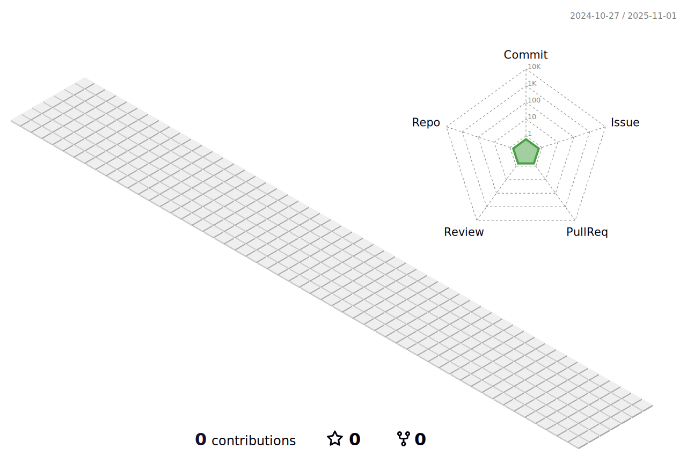

# Gabriel Silva
- 🦈 Estou em constante desenvolvimento pessoal buscando a melhor versão de mim mesmo.
- 💻 Atualmente estudando Análise e Desenvolvimento de Sistemas. [UNIP Sorocaba]
- 💻 Estudando Linguagens de Programação. [Curso em Vídeo - Gustavo Guanabara]
- 🔓 Cursando a Pato Academy - Do Bug ao Bounty [Hacker Ético - Gabriel Pato]
- 👨‍💻 Desenvolvedor Bubble - No Code.
- 👨‍💻 Aberto a novas oportunidades e desafios.

## Status

## Idiomas
 <i>Português｜Portuguese</i>  
 <i>Japonês｜日本語</i>  
 <i>Inglês｜English </i>  
 
 ## Hobbies
 <i>📚 Livros </i>  
 <i>🮠Video Games </i>  
 <i>🏋️‍♂️ Esportes </i>  
 
## Redes Sociais 

  
